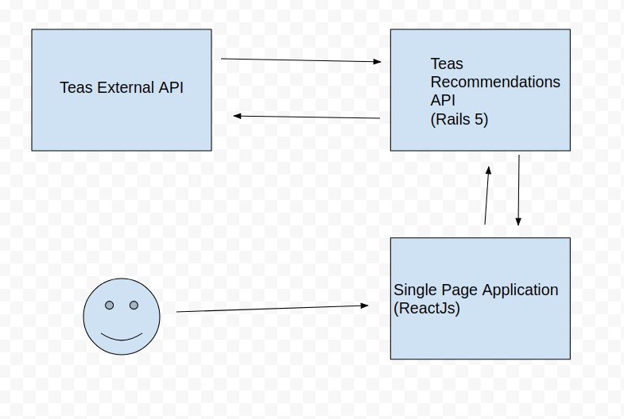

# Tea Shop

## Summary
Tea shop is a simple solution to buy teas on web !

The system was developed with docker. Reason: to build something similar to the use of microservices.
But why? To maintain isolated services that perform only their functions. In addition, this type of architecture generates less dependence between the diverse teams involved in the development and better infrastructure management.

Its operation is simple. The user navigates the SPA, this asks for recommendations to the recommendations API.
Finally, the recommendations API search the data in an external api and returns all over the way to user.
Everything can be seen in the figure below:



The api was developed in  rails 5 api mode and the SPA was developed using Reactjs and React-Router.

## Getting Started

These instructions will get you a copy of the project up and running on your local machine for development and testing purposes. See deployment for notes on how to deploy the project on a live system.

To help run in terminal:
```
make help
```

### Prerequisites

Before all, you need to have Docker and Docker compose installed in your computer.
For more informations you can access [Docker page](https://www.docker.com/).

### Installing

After clone, run in terminal:
```
make setup
```

### Running the locally

After install, run in terminal:
```
make run
```
After this, you can access the app in http://localhost:4000/.

### API Notes

To develop backend with TDD run:
```
make run-dev-env-api
```
Now, you are in api container. To run automated test env run:
```
make auto-test
```

### Client Notes
To develop backend with TDD run:
```
make run-dev-env-client
```
Now, you are in client container. To run automated test env run:
```
npm test
```

## Deployment

TODO:
* MVP => Prod configs to deploy in Heroku

## Contributing

* Only have to fork the project and make a pull request.

## Git Style

We use something like [Karma](http://karma-runner.github.io/1.0/dev/git-commit-msg.html) for commit messages.
Besides this, for new branchs use names in this format:
```
type/description
```
For example: to create a new branch that is responsible for create user permissions you must use feat/create-user-permissions.

## Versioning

We use [SemVer](http://semver.org/) for versioning.

## License

Not yet defined.

## Final Notes
